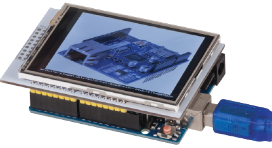

# Arduino Picture Frame
_Project 00003_

There's not a lot to construct in this project- it's just an Uno and LCD Touch Shield, but if you want a simple project that looks slick, then it's a good place to start. We call it a 'Picture' frame because it only supports .BMP bitmap files. It's possible to decode .JPG's with Arduino, but we would need to use a Mega board for the memory requirements, and this approach makes the program more portable if you'd like to use the code in different applications. And it's pretty straightforward to convert your photos into .BMP files for the Arduino Picture Frame to display.



## Bill of Materials
| Qty | Code | Description |
| --- | --- | ---|
|1 | [XC4410](http://jaycar.com.au/p/XC4410) | Uno main board
|1 | [XC4630](http://jaycar.com.au/p/XC4630) | LCD touchscreen
|1 | [XC4983](http://jaycar.com.au/p/XC4983) | 8GB Micro SD card

* SD Card reader is needed to load images into the unit


## Connection Table

Mount the shield ontop of the Uno.


## Software Libraries
|Library | Author
| --- |--- |


## Assembly
Mount the shield ontop of the UNO.

## Programming
Download the source code and extract into a new folder, open the .ino file in the Arduino IDE and press upload.

We've included the library for the LCD shield but there's been two versions of the LCD shield, so if you find that it doesn't work straight away, try changing "XC4630d.h" and
swapping what version it is:

```c
#define XC4630_v1
//#define XC4630_v2
```

The sketch doesn't need much configuration, `picdelay` is the seconds between each picture and `showname` is whether you want the unit to show the filename

```c
int picdelay=5; //delay between images
byte showname=1; //flag to show filename or not
```
## Use
* The Arduino Picture Frame only supports .BMP files- it can handle monochrome, 16-
colour, 256-colour and 24 bit bitmaps, which pretty much covers anything that Microsoft Paint can create.

* There is no size limit, although the picture frame doesn't do any scaling, so anything bigger than 320 by 240 pixels will not be displayed in full anyway. Paint can do one image at a time - you can use the resize tool to scale photos down, then save as .BMP type. Other programs might allow batch processing of multiple files, but we found that Paint was enough for our purposes.

* The sketch also includes a routine for finding the Long File Name of the file and displaying it. The screen can only hold 53 characters across and can't decode names more than  104 characters due to memory limitations. If you like, you can give your files relevant names so that they will be displayed over the pictures.

* The last point to remember about the files is that the sketch only reads from the root folder- any files in subfolders are ignored.

Unplug the Uno, place the Micro SD Card into the card slot on the LCD Shield, then plug the Uno back in. The
first picture should appear within a few seconds, and then cycle through the rest of the files on the folder. Note
that the pictures are drawn from the bottom up- this is due to the way that .BMP files are usually laid out.

## Future Improvements
* try making your own 3D printed case
